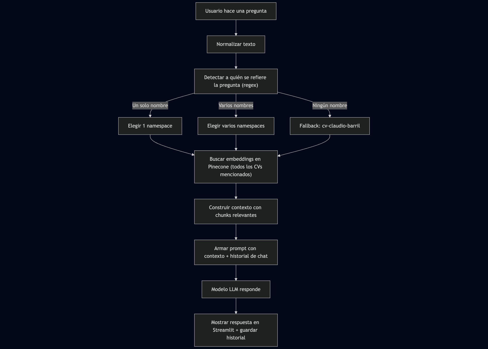

# Entrega de trabajos prácticos de NLP II

Alumno: **Claudio Barril** (a1708)  
  ✉️ [claudiobarril@gmail.com](mailto:claudiobarril@gmail.com)

Aquí tienes un ejemplo de documentación para el **README** de tu proyecto en formato **Markdown**, integrando lo que mencionaste (approach inicial, mejoras, MoE, Expert y generateV2):

## TP1: TinyGPT con Mixture of Experts y Estrategias de Sampling

### Descripción
Este proyecto implementa un modelo de lenguaje basado en **GPT** con incorporación de **Mixture of Experts (MoE)**.  
Se busca explorar mejoras en generación de texto mediante distintas estrategias de sampling y la optimización de capas expertas para una mayor capacidad expresiva del modelo.

### Estructura del Proyecto

El contenido del trabajo se encuentra organizado en la carpeta notebooks.
- `checkpoints/`: contiene los modelos guardados entrenados.
- `tp1.ipynb`: Notebook con el desarrollo del trabajo, con los análisis y conclusiones parciales y totales.
- `trainer.py`: Implementación del loop de entrenamiento provisto por la materia.

---

## TP2: Chatbot con RAG y Vector DB

### Descripción
Este proyecto implementa un chatbot utilizando **RAG (Retrieval-Augmented Generation)** y una base de datos vectorial para mejorar la precisión y relevancia de las respuestas generadas.

### Estructura del Proyecto

El contenido del trabajo se encuentra organizado en la carpeta chatbot.
- `cv/`: Carpeta donde debe colocarse el CV a cargar en la base de datos vectorial.
- `cv_loader.py`: Script para cargar el CV en la base de datos vectorial.
- `test_index.py`: Script para probar la indexación del CV en la base de datos vectorial.
- `chatbot.py`: Implementación del chatbot con RAG.

### Decisiones de Diseño

#### Modelo de Embeddings
- Se utiliza `intfloat/multilingual-e5-base` por su capacidad multilingüe, ideal para procesar el CV en español
- El modelo está optimizado para búsqueda semántica y es compatible con consultas en múltiples idiomas
- Genera vectores de 768 dimensiones que capturan efectivamente el significado semántico del texto

#### Procesamiento del CV
- Tamaño de chunk: 800 caracteres
  - Equilibrio entre granularidad y contexto
  - Permite mantener secciones cohesivas del CV como experiencia laboral o educación
- Overlap de 100 caracteres
  - Evita pérdida de contexto entre chunks
  - Mejora la recuperación de información que podría quedar dividida

#### Interfaz del Chatbot
Se mantuvieron las funcionalidades de configuración del curso base:
- Selección de modelos LLM (Llama 3, Mixtral, Gemma)
- Control de memoria conversacional
- Gestión de historial
- Estas opciones permiten experimentar y comparar diferentes configuraciones

### Arquitectura
El chatbot utiliza una arquitectura RAG (Recuperación Aumentada con Generación):
1. Los documentos del CV se almacenan como embeddings en la base de datos vectorial Pinecone
2. Las preguntas del usuario se convierten en embeddings y se comparan con el contenido del CV
3. Las secciones relevantes del CV se recuperan y envían como contexto a un LLM de Groq (Llama 3, Mixtral o Gemma)
4. El LLM genera una respuesta en lenguaje natural basada en el contexto recuperado

### Ejecución

#### Prerequisitos
Configurar variables de entorno en el sistema o archivo `.env`:
```bash
    export PINECONE_API_KEY="tu-clave-pinecone"
    export GROQ_API_KEY="tu-clave-groq"
```

#### Cargar el CV
```bash
    python chatbot/cv_loader.py
```

#### Probar la Indexación
```bash
    python chatbot/test_index.py "{pregunta de ejemplo}"
```

#### Iniciar el Chatbot
1. Ejecutar:
```bash
    streamlit run chatbot/chatbot.py
```
2. Acceder al chatbot en http://localhost:8501

#### Características:

- Elección entre diferentes modelos LLM
- Ajuste de la longitud de memoria de conversación
- Limpieza del historial de conversación
- Interfaz conversacional natural
- Recuperación de información del CV en tiempo real

## TP3: Chatbot con Agente decisor

### Descripción

Este proyecto implementa un chatbot que utiliza un agente decisor para responder preguntas sobre el CV de múltiples estudiantes. El agente decisor identifica a qué estudiante o estudiantes se refiere la pregunta y recupera el/los CV/s correspondiente/s desde una base de datos vectorial. En caso de que no se pueda identificar a un estudiante, se utiliza el CV de Claudio Barril por defecto.

### Estructura del Proyecto
El contenido del trabajo se encuentra organizado en la carpeta `chatbot_agent`.
- `diagram/flow.png`: Diagrama de flujo del proceso de decisión del agente y resolución de la pregunta.
- `cvs/`: Carpeta donde se encuentran los CVs a cargar en la base
- `agent.py`: Implementación del agente decisor que determina a qué CV/s consultar.
- `tools.py`: Herramientas de búsqueda para cada CV individual.
- `cvs_loader.py`: Script para cargar los CVs en la base de datos vectorial, en distintos namespaces del mismo índice.
- `test_agent.py`: Script para probar el agente con una pregunta de ejemplo.
- `chatbot_agent.py`: Interfaz principal del chatbot con Streamlit.

### Decisiones de Diseño

#### Arquitectura del Agente Decisor

La aplicación utiliza una arquitectura basada en agentes que separa la lógica de decisión de la búsqueda de información:

1. Agente Central (`Agent`): Coordina el proceso completo

- Analiza la pregunta del usuario para identificar nombres mencionados
- Decide qué namespaces consultar
- Combina información de múltiples fuentes
- Genera respuesta final contextualizada


2. Herramientas Especializadas: Cada CV tiene su propia herramienta de búsqueda
- `search_cv_claudio()`: Busca información en el CV de Claudio Barril
- `search_cv_victoria()`: Busca información en el CV de Victoria Terán
- `search_cv_lara()`: Busca información en el CV de Lara Rosenberg

#### Detección de Entidades
El sistema utiliza expresiones regulares normalizadas para detectar nombres en las preguntas:
```
person_patterns = {
    "cv-claudio-barril": re.compile(r"\b(claudio|barril)\b", re.IGNORECASE),
    "cv-victoria-teran": re.compile(r"\b(victoria|ter[aá]n)\b", re.IGNORECASE),
    "cv-lara-rosenberg": re.compile(r"\b(lara|rosenberg)\b", re.IGNORECASE),
}
```

Ventajas de este enfoque:
- Manejo de acentos y variaciones ortográficas
- Detección por nombre o apellido
- Flexibilidad para preguntas sobre múltiples personas
- Fallback inteligente al CV por defecto

#### Gestión de Múltiples Namespaces en Pinecone
La decisión de utilizar un solo índice de Pinecone con 3 namespaces diferentes ofrece ventajas significativas:

**Ventajas Técnicas:**

1. Eficiencia de Recursos: Un solo índice consume menos recursos computacionales y de almacenamiento
2. Gestión Simplificada: Administrar un índice es más simple que coordinar múltiples índices
3. Consistencia de Embeddings: Todos los CVs utilizan el mismo modelo de embeddings, garantizando comparabilidad
4. Latencia Optimizada: Una sola conexión a Pinecone reduce la latencia de red

**Ventajas de Costos:**

1. Escalabilidad: Más económico escalar horizontalmente agregando namespaces que creando nuevos índices
2. Mantenimiento: Menor costo operativo al mantener una sola instancia

**Ventajas Funcionales:**

1. Búsquedas Cross-CV: Permite comparar información entre diferentes CVs fácilmente, aunque actualmente el agente no se aprovecha esta capacidad
2. Agregación de Resultados: Facilita combinar información de múltiples personas en una respuesta
3. Aislamiento Lógico: Los namespaces mantienen separada la información de cada persona

**Estructura de Namespaces:**
```
cvs-index/
├── cv-claudio-barril/    # CV de Claudio Barril
├── cv-victoria-teran/    # CV de Victoria Terán  
└── cv-lara-rosenberg/    # CV de Lara Rosenberg
```

#### Procesamiento de Texto
El sistema incluye normalización de texto para mejorar la detección. Esta normalización:
- Convierte a minúsculas
- Elimina acentos y diacríticos

#### Modelo de Embeddings
- **Modelo:** intfloat/multilingual-e5-base
- **Justificación:** De la misma manera que en el proyecto anterior, este modelo es ideal para manejar múltiples idiomas y es especialmente adecuado para procesar textos en español.

#### Memoria Conversacional
Se utiliza nuevamente una memoria de conversación para mantener el contexto de la interacción con el usuario, mejorando la coherencia de las respuestas.

### Diagrama de Flujo

```
flowchart TD

A[Usuario hace una pregunta] --> B[Normalizar texto]
B --> C["Detectar a quién se refiere la pregunta (regex)"]
C -->|Un solo nombre| D[Elegir 1 namespace]
C -->|Varios nombres| E[Elegir varios namespaces]
C -->|Ningún nombre| F[Fallback: cv-claudio-barril]

D --> G[Buscar embeddings en Pinecone]
E --> G["Buscar embeddings en Pinecone (todos los CVs mencionados)"]
F --> G

G --> H[Construir contexto con chunks relevantes]
H --> I[Armar prompt con contexto + historial de chat]
I --> J[Modelo LLM responde]
J --> K[Mostrar respuesta en Streamlit + guardar historial]
```


### Componentes del Sistema

1. **Agent (agent.py)**
Clase principal que coordina todo el proceso:

**Responsabilidades:**

- Análisis de la pregunta del usuario
- Selección de namespaces relevantes
- Coordinación de búsquedas en múltiples CVs
- Construcción de contexto enriquecido
- Generación de respuesta final

**Características clave:**

- Detección automática de nombres mediante regex
- Soporte para consultas multi-persona
- Memoria conversacional configurable
- Fallback inteligente al CV por defecto

2. **Tools (tools.py)**
Herramientas especializadas para búsqueda en cada CV:

**Funcionalidades:**
- Búsqueda vectorial en Pinecone
- Recuperación de chunks relevantes (top_k=3)
- Extracción de metadatos
- Formateo de resultados

**Configuración:**
- Índice: cvs-index
- Modelo: intfloat/multilingual-e5-base
- Top-k: 3 resultados más relevantes por CV

3. **Chatbot Interface (chatbot_agent.py)**
Interfaz de usuario desarrollada con Streamlit:

**Características:**
- Selección de modelos LLM (Llama 3, Mixtral, Gemma)
- Control de memoria conversacional (1-10 mensajes)
- Interfaz conversacional intuitiva

### Ejecución

#### Prerequisitos
Configurar variables de entorno en el sistema o archivo `.env`:
```bash
    export PINECONE_API_KEY="tu-clave-pinecone"
    export GROQ_API_KEY="tu-clave-groq"
```

#### Cargar el CV
```bash
    python chatbot_agent/cvs_loader.py
```

#### Probar el agente
```bash
    python chatbot_agent/test_agent.py "{pregunta de ejemplo}"
```

#### Iniciar el Chatbot
1. Ejecutar:
```bash
    streamlit run chatbot_agent/chatbot_agent.py
```
2. Acceder al chatbot en http://localhost:8501

